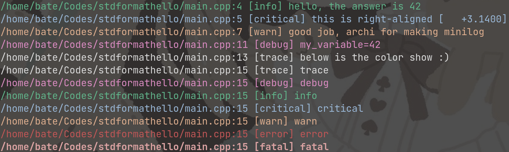

# minilog

Mini Logging Library for C++20

> This is a single-header-only log library, simply copy the `minilog.h` to your project (C++20 required) and include it would work.

```cpp
#include "minilog.h"

int main() {
    minilog::log_info("hello, the answer is {}", 42);
    minilog::log_critical("this is right-aligned [{:>+10.04f}]", 3.14);

    minilog::log_warn("good job, {1:.5s} for making {0}", "minilog", "archibate");
    minilog::set_log_level(minilog::log_level::trace); // default log level is info

    int my_variable = 42;
    MINILOG_P(my_variable); // shown when log level lower than debug
}
```



> Formatting are based on C++20 [`std::format`](https://en.cppreference.com/w/cpp/utility/format/format).

```bash
cmake -B build
cmake --build build
export MINILOG_LEVEL=trace  # set default log level from environment variable
build/main
```

Demostration video: https://www.bilibili.com/video/BV1t94y1r72E

Available log levels are:

- trace
- debug
- info
- critical
- warn
- error
- fatal
